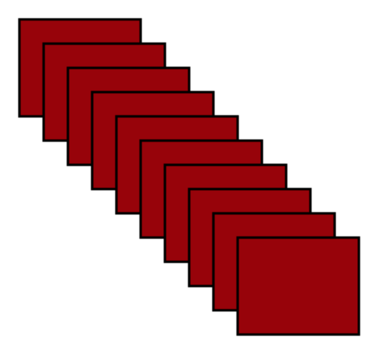

#Advanced JavaScript

##Object Literals

#####Setting up object literals

- Object literals allow us to set up JavaScript objects ourselves using the curly-bracket notation.
- Data is written as a comma-separated list of key-value pairs.

```javascript
var person = {
	firstname: "Arun",
	lastname: "Sood",
	username: "arsood",
	role: "Instructor"
};
```

#####Accessing object literal properties

- Values are referenced by the .dot notation, or the ["key"] syntax.
- In the example above, we can access properties like so:

```javascript
console.log(person.firstname);
console.log(person.lastname);
console.log(person.username);
console.log(person.role);
```

- We could also use the `["key"]` syntax:

```javascript
console.log(person["firstname"]);
console.log(person["lastname"]);
console.log(person["username"]);
console.log(person["role"]);
```

#####Enumerating through objects

- Enumeration essentially means iterating through the object and doing something with each key and value pair.
- In JavaScript we can use the `for..in` loop to iterate through objects:

```javascript
for (key in person) {
	console.log(key);
	console.log(person[key]);
}
```

#####Object literals can contain many data types including functions

- References to functions can be made inside object literals.
- Functions inside objects can use the `this` keyword to access properties in that object.

```javascript
var person = {
	firstname: "George",
	lastname: "Andrews",
	age: 34,
	sayName: function() {
		alert(this.firstname + " " + this.lastname);
	}
};

person.sayName();
```

##Closures in JavaScript
- The concept of closures is very tied in with the idea of scope.
- Closures dictate where data can be accessed throughout a program depending on where it is defined.
- JavaScript is interesting in terms of scope because of a process known as "hoisting".
- Let's take the following example:

```javascript
greet = "Hello World!";

alert(greet);

var greet;
```

- From the start you may think that since the variable `greet` is not defined (through `var`) before using it in the `alert`, the result of the alert would be undefined.
- What actually happens is that when the program is run, each variable declaration gets pushed to the top of its current scope.
- The reason this works is because `var greet` is a declaration, not an expression. Declarations are "hoisted" to the top of their scope.
- This also occurs with functions:

#####Function declaration

```javascript
sayHello();

function sayHello() {
	alert("Hello!");
}
```

- This works because the declaration gets pushed to the top of the scope.

#####Function expression

```javascript
sayHello();

var sayHello = function() {
	alert("Hello!");
}
```

- This does not work because expressions are not hoisted.

##Recursion
- Recursion is the process of calling a function within itself.
- It is often used in cases when you need to re-run code that preceeds the program's current position based on some condition.
- Let's take this simple example:

```javascript
function sayName() {
	var name = prompt("What is your name?");
	
	if (name === "Arun") {
		alert("Hey Arun!");
	} else {
		sayName();
	}
}
```

- Here we want to re-run the whole function is the name does not equal "Arun".

#####Recursion in the real-world

- Recursion is often used in cases when you are searching for something when you don't know the structure.
- Let's consider this API request:

```
https://api.spotify.com/v1/search?q=you+make+me&type=track&limit=1
```

- Let's imagine that this structure changes daily/monthly/weekly whatever it may be, but we still want to be able to pull out the value of `preview_url`.

##Constructors
- Constructors are JavaScript functions that are responsible for creating objects based on parameters.
- Constructors are similar to classes in other OOP languages.
- Constructors often have "prototype" methods associated with them, which are functions that can access the constructor's scope.

#####Comparison to object literals

```javascript
{
	name: "Arun Sood",
	role: "Instructor",
	username: "arsood",
	email: "arun@ga.co"
}
```

- Let's compare that now to a constructor that accomplishes relatively the same thing:

```javascript
function Person(name, role, username, email) {
	this.name = name;
	this.role = role;
	this.username = username;
	this.email = email;
}
```

- Do you notice any differences?

##Creating an Instance of a Constructor
- Creating an instance of a constructor is accomplished through the `new` keyword:

```javascript
var arun = new Person("Arun Sood", "Instructor", "arsood", "arsood@gmail.com");
```

##Prototypes
- Prototypes allow us to create methods that are attached to our newly-generated objects.
- They usually extend functionality related to that specific "logical concern."
- While thinking about a car, you may do various things with it:

#####Drive it:

```javascript
Car.prototype.drive = function() {
	console.log("We are driving!");
}
```

#####Paint it:

```javascript
Car.prototype.paint = function(newColor) {
	this.color = newColor;
	console.log("Our new color is: " + newColor);
}
```

#####Describe it:

```javascript
Car.prototype.describeCar = function() {
	console.log("We are driving in a " + this.color + " " + this.make + " " + this.model + " that is from the year " + this.year);
}
```

- We can see here that prototypes inherit the scope of their parent constructor.

#####Call a prototype function:

```javascript
var myCar = new Car("Honda", "Civic", 2004, "Red");

myCar.describeCar();
```

##Prototypal Inheritance
- So far we have seen an example of a single-level prototype chain.
- In the wild you will likely see multi-level chains that inherit properties from other "classes."
- Inheritance is usually done in JavaScript via a two-step process:
	1. Set the prototype of the subclass (the class that will get methods and properties from it's parent, which is also known as the superclass) to a new instance of the superclass (also known as parent class).
	2. Set the constructor of the subclass equal to it's constructor function (which was overwritten when the prototype was set to the superclass). For more info on why this is necessary refer to [this](http://stackoverflow.com/questions/8453887/why-is-it-necessary-to-set-the-prototype-constructor) post.
- Let's take an example of a student inheriting from a person class:

```javascript
function Animal (name) {
	this.name = name;
}

Animal.prototype.walk = function () {
	console.log(this.name + ' the ' + this.color + ' ' + this.breed + ' is walking.');
};

function Cat(color, breed, name) {
	this.color = color;
	this.breed = breed;

	Animal.call(this, name);
}

Cat.prototype = new Animal();
Cat.prototype.constructor = Cat;

var myPet = new Cat("Black", "Shorthair", "Maddie");
myPet.walk();
```

##Inheritance Exercise
- Create a constructor function that will construct a plant object with country and isOrganic properties.
- Develop two prototype methods on Plant - showNameandColor and amIOrganic.
- Write a constructor function for a fruit that will contain name and color properties.
- Set the fruit prototype as an instance of a plant.
- Reset the fruit constructor.
- Try calling the showNameandColor as well as the amIOrganic functions on a new instance of a fruit.

##.hasOwnProperty()
- This is a methods for checking if a property is available on an object.
- The syntax must be written in quotes.
- Let's take a look at an example:

```javascript
var cake = {
	food: "cake"
}

cake.hasOwnProperty("food"); // returns true
```

- Let's do a slightly more complex example involving inheritance:

```javascript
function Person(name) {
	this.name = name;
}

Person.prototype.greet = function() {
	return "Hello, my name is " + this.name;
};

function Student(name, course) {
	this.name = name;
	this.course = course;
};

Student.prototype = new Person
Student.prototype.constructor = Student;

p = new Person("bob");
s = new Student("tom");

p.hasOwnProperty("name"); //returns true
s.hasOwnProperty("course"); //returns true
s.hasOwnProperty("name"); //returns true
```

##instanceof
- This is a common method that allows us to check if a specific object is an instance of a class.

Basic example:

```javascript
var color = "Green";

color instanceof String; //returns true
```

Example with inheritance:

```javascript
function Person(name) {
	this.name = name;
}

Person.prototype.greet = function() {
	return "Hello, my name is " + this.name;
};

function Student(name, course) {
	this.name = name;
	this.course = course;
};

Student.prototype = new Person
Student.prototype.constructor = Student;

p = new Person("bob");
s = new Student("tom");

s instanceof Person //returns true
p instanceof Student //returns false
Person instanceof Object //returns true
```

##HTML5 LocalStorage
- LocalStorage is a prototype function of the `window` global object.
- It allows you to save up to 5MB of data per domain locally on the browser.
- It was meant to help replace functionality that was otherwise accomplished via cookies.
- We will be using it to practice persisting data in our application.

#####Saving to localStorage
- localStorage only accepts data as a string.
- If you want to save arrays or objects you must first use `JSON.stringify()` to convert them into string data.

```javascript
window.localStorage.setItem("name", "Arun");
```

#####Retrieving from localStorage
- You may use `JSON.parse()` to retrieve the data in its original format when you need it back since it will be saved as a string.

```javascript
window.localStorage.getItem("name");
```

#####Removing from localStorage

```javascript
window.localStorage.removeItem("name");
```

#####Clearing localStorage

```javascript
window.localStorage.clear();
```

##SessionStorage
- sessionStorage is much like localStorage except it only persists for the current "session."
- When the browser is closed sessionStorage is cleared.
- It has similar getter and setter methods:

```javascript
window.sessionStorage.setItem("key", "value");

window.sessionStorage.getItem("key");
```

##Prototypal Inheritance Lab
- We will be creating a todo list using the OOP principles of prototypes and prototypal inheritance.
- Here are the steps we will follow:
	1. Create a Todo constructor that has the following attributes - todo, created_at.
	2. Create a constructor called SaveRender that will have two prototype functions - saveToLs and renderTemplate.
	3. Create the basic logic for the above two functions without worrying about inheritance quite yet.
	4. Have the SaveRender functions inherit into your Todo class, and call them to create the app functionality.

##Detect HTML5 Features
- In order to use any of the exciting HTML5 features you should make sure they are available on the target browser.
- There are in-built ways to do this, and also a library called Modernizr that makes it easier.

##In-Built Feature Detection
- Check if a certain property exists on a global object (window or navigator for example).
	- Example: Check for geolocation support on the navigator object.
- Create an element, then check if a certain property exists on that element.
	- Example: Test for canvas support.
- Create an element, check if a certain method exists on that element, then call the method and check the value it returns.
	- Example: Test which video formats are supported.
- Create an element, set a property to a certain value, then check if the property has retained its value.
	- Example: Testing which `<input>` types are supported.

##Feature Detection with Modernizr
- Let's take a look at the [Modernizr documentation](http://modernizr.com/).
- Modernizr can detect JavaScript capabilities in addition to CSS3 capabilities.
- Let's take a look at some of the things you can detect:

Canvas Support:

```
Modernizr.canvas
```

Geolocation Support:

```
Modernizr.geolocation
```

Specific Video Formats:

```
Modernizr.video.h264
```

CSS3 Font Face:

```
Modernizr.fontface
```

3D Transforms:

```
Modernizr.csstransforms3d
```

##HTML5 Canvas
- Canvas allows many kinds of image manipulation through JavaScript.
- You can create static images or dynamic scenes.
- Canvas currently only supports 2D scenes but may support 3D scenes in the near future.

##Canvas Exercise: A Simple Drawing
- We will use canvas to draw a simple line and rectangle.
- The final result will look like this:


Step 1: Select the canvas element

```
var canvas = document.getElementById("my-canvas");
```

Step 2: Get the canvas "context"

```
var canvas_context = canvas.getContext("2d");
```

- The context is what you draw on using JavaScript.

Step 3: Fill the rectangle onto the context

```
canvas_context.fillRect(100, 100, 200, 200);
```

Step 4: Create the line

```
canvas_context.beginPath();

canvas_context.moveTo(400, 100);

canvas_context.lineTo(400, 300);

canvas_context.stroke();
```

##Kinetic JS: A Canvas API
- Canvas is not incredibly intuitive to use, and there is quite a lot you can do with it.
- Canvas APIs such as [KineticJS](http://kineticjs.com/), [PaperJS](http://paperjs.org/), and [RaphaelJS](http://raphaeljs.com/) are commonly used to maximize the canvas potential.
- We will be practicing using KineticJS to create a scene of rectangles that are draggable:



####Everything in Kinetic starts with a "stage" that will contain the canvas:

```
var stage = new Kinetic.Stage({
	container:'container',
	width:700,
	height:500
});
```

####Next we need to create a layer to add elements too:

```
var layer = new Kinetic.Layer();

stage.add(layer);
```

####Add rectangles to layer:

```
for (var i = 0; i < 10; i++) {
	var rect = new Kinetic.Rect({
		x:10 + (i * 20),
		y:10 + (i * 20),
		width:100,
		height:80,
		fill:"#900",
		draggable:true,
		stroke:"#000000",
		strokeWidth:2
	});

	layer.add(rect);
	layer.draw();
}
```

####With canvas you can even save the entire stage to JSON to be retrieved at a later time:

```
localStorage.setItem("rectangle_sample", stage.toJSON());
```

##Exercise: Preserve Canvas State
- In this exercise you will create a new canvas drawing using circles.
- Position the circles wherever you like throughout the canvas.
- Save the canvas to JSON and store in localStorage.
- Upon refresh of the page check if the localStorage property exists and render the canvas as it was.